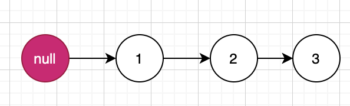

### 题目
给你一个链表，删除链表的倒数第 n 个结点，并且返回链表的头结点。

进阶：你能尝试使用一趟扫描实现吗？

示例1：
```
输入：head = [1,2,3,4,5], n = 2
输出：[1,2,3,5]
```

示例 2：
```
输入：head = [1], n = 1
输出：[]
```
示例 3：

```
输入：head = [1,2], n = 1
输出：[1]
```

### 解法一
刚好在剑指offer中刷到过类似的题目：[链表中倒数第k个结点](../../剑指offer/15.链表中倒数第k个结点/solution.py)

按照剑指offer中的解法，使用双指针可以快速找到第n个结点。定位到了之后，记录其前一个结点，然后：
```py
pre.next = pre.next.next
```
这样就解决了问题，开始实现：
[solution1](solution1.py)

这里尤其要注意的是，如果p_slow停留在head，那说明要删除的结点就是head，这时就不能直接return head了，需要返回其next。

### 优化解法
第一种解法时间复杂度是ok的。那有没有什么问题呢？如下：
```py
# p_slow为头结点，说明要删除的是头结点
if p_slow is head:
    return head.next
```
也就是说，需要注意这个边界条件。而这个边界条件的添加还是我submit有些case没通过才想到去添加的。
因此解法一的问题在于如果删除的是头结点时，需要额外注意。下面介绍一个更加容易理解的解法。

**哨兵节点**，其实就是一个附加在原链表最前面用来简化边界条件的附加节点，它的值域不存储任何东西，只是为了操作方便而引入。比如原链表为1->2->3，则加了哨兵节点的链表即为null->1->2>3，如下图：


在本题中，如果引入哨兵节点，那么所有删除节点的操作都为：
```py
pre.next = pre.next.next
```
这个解法与解法一的时间复杂度是一样的。具体步骤为：
1. 设置哨兵结点guard_node，chushih
2. p_pre定义为要删除结点的前一个结点，初始化指向guard_node
3. p_fast初始化指向头结点，开始遍历
4. 当p_fast与p_pre相隔n（倒数第n个）时，两个指针一起遍历。
5. 删除p_pre的下一个结点。