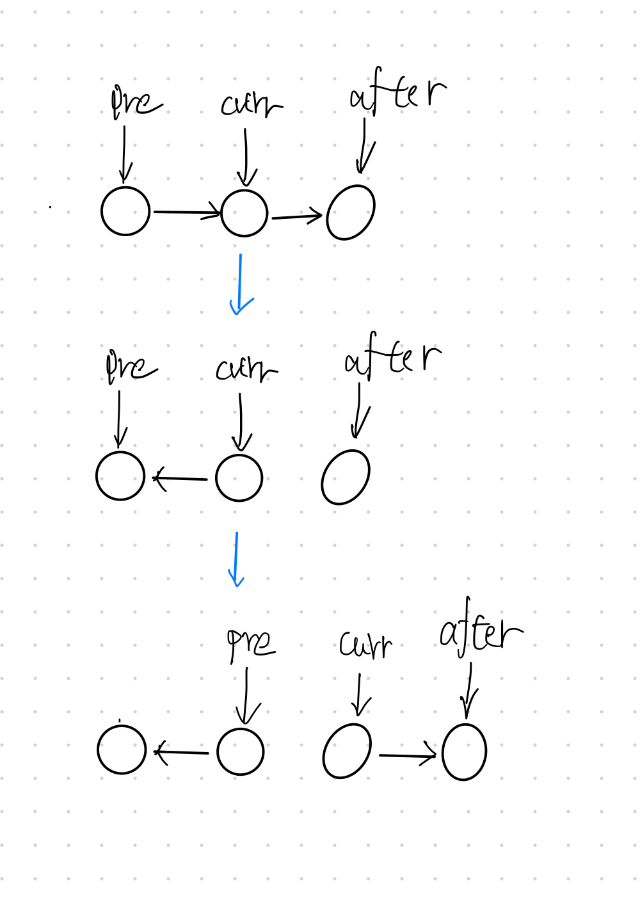

### 题目
反转一个单链表。

示例:
```
输入: 1->2->3->4->5->NULL
输出: 5->4->3->2->1->NULL
```

进阶:
你可以迭代或递归地反转链表。你能否用两种方法解决这道题？

### 解题

#### 迭代解题
一次反转的操作如图：



就是3个指针的操作。将当前结点的指针指向上一个结点。最后要注意更新结点。

使用迭代解题，就是将当前结点指向上一个结点，然后更新当前结点到下一个结点。
代码实现：
```py
class Solution:
    def reverseList(self, head: ListNode) -> ListNode:
        if head is None:
            return None
        prev = None
        while head:
            # 先记录下一个节点，否则等下head.next指向前一个结点会造成丢失
            next_node = head.next
            # 指向上一个结点完成翻转
            head.next = prev
            prev = head
            head = next_node
        return prev
```
#### 递归解题

使用递归解题，代码就简单多了。这里看做有两个链表，new_head指向已翻转的链表，head指向还未翻转的链表。将未翻转的头结点指向已翻转链表的头结点，并更新值。
```py
class Solution:
    def reverseList(self, head: ListNode) -> ListNode:
        return self.reverse_list(head, None)

    # new_head指向已翻转结点的头结点
    def reverse_list(self, head: ListNode, new_head: ListNode) -> ListNode:
        if head is None:
            return new_head
        a = head.next
        head.next = new_head
        return self.reverse_list(a, head)
```