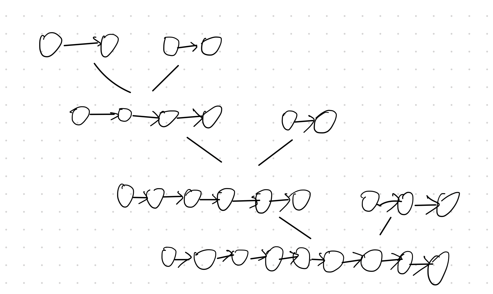
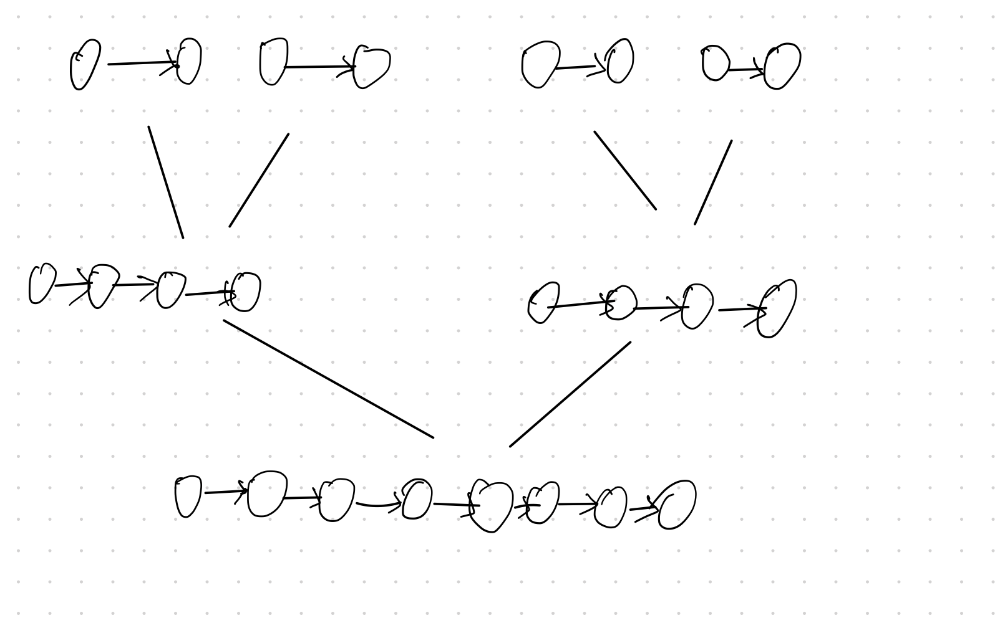

### 题目
给你一个链表数组，每个链表都已经按升序排列。
请你将所有链表合并到一个升序链表中，返回合并后的链表。
示例 1：
```
输入：lists = [[1,4,5],[1,3,4],[2,6]]
输出：[1,1,2,3,4,4,5,6]
解释：链表数组如下：
[
  1->4->5,
  1->3->4,
  2->6
]
将它们合并到一个有序链表中得到。
1->1->2->3->4->4->5->6
```

示例 2：
```
输入：lists = []
输出：[]
```

示例 3：
```
输入：lists = [[]]
输出：[]
```

提示：

- k == lists.length
- 0 <= k <= 10^4
- 0 <= lists[i].length <= 500
- -10^4 <= lists[i][j] <= 10^4
- lists[i] 按 升序 排列
- lists[i].length 的总和不超过 10^4

### 解题
刚做完[21.合并两个有序链表](../21.合并两个有序链表/readme.md)，这道题明显是个升级版。

那很简单的一个思路就是利用第21题的解法，先两两合并，然后拿合并好的链表与下一个链表继续进行合并，图示(灵魂手绘，懂的都懂~)：



解法一的代码实现如下，也可查看[文件](solution.py).
```py
class Solution:
    def mergeKLists(self, lists: List[ListNode]) -> ListNode:
        if lists is None or len(lists) == 0:
            return None
        elif len(lists) == 1:
            return lists[0]
        
        dummy = ListNode(0)
        p1 = lists[0]
        # 进行两两合并。
        for i in range(1, len(lists)):
            p1 = self.merge_two_lists(p1, lists[i])
            dummy.next = p1

        return dummy.next

    # 合并两个升序链表，查看21题的解法。
    def merge_two_lists(self, l1: ListNode, l2: ListNode) -> ListNode:
        dummy = cur = ListNode(0)
        while l1 and l2:
            if l1.val < l2.val:
                cur.next = l1
                l1 = l1.next
            else:
                cur.next = l2
                l2 = l2.next
            cur = cur.next
        cur.next = l1 or l2
        return dummy.next
```
这个解法被Accepted了，但是有没有优化空间呢？看上面的图其实也可以看出，拿已经合并的链表和新的链表对比，已经合并的链表会越来越长，时间复杂度就会增加。这里想到可以用二分法的思路来做，将所有的链表两两分组，先把一组中的两个合并，合并完后跟另外一组的合并好的链表合并。图示如下：


代码实现如下：