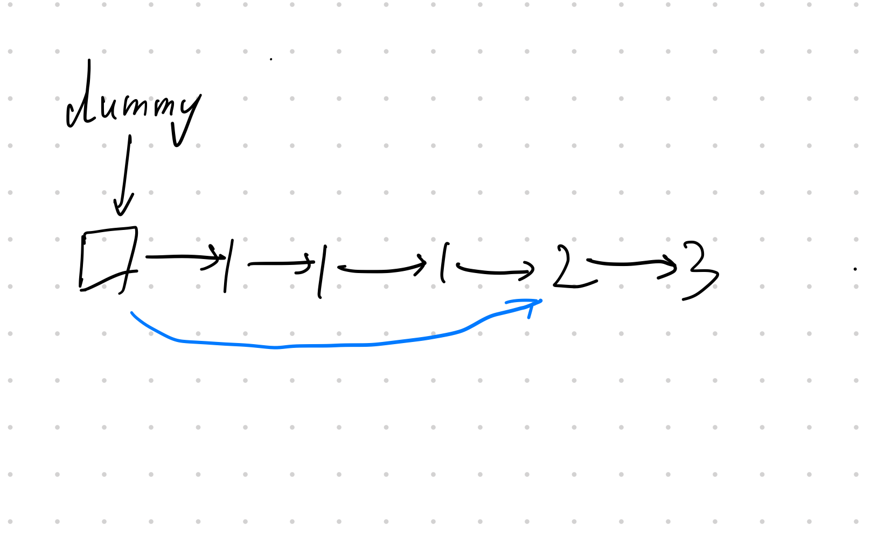

### 题目
存在一个按升序排列的链表，给你这个链表的头节点 head ，请你删除链表中所有存在数字重复情况的节点，只保留原始链表中没有重复出现的数字。

返回同样按升序排列的结果链表。

示例1：
```
输入：head = [1,2,3,3,4,4,5]
输出：[1,2,5]
```
示例2：
```
输入：head = [1,1,1,2,3]
输出：[2,3]
```

提示：
- 链表中节点数目在范围 [0, 300] 内
- -100 <= Node.val <= 100
- 题目数据保证链表已经按升序排列

### 解题
做完了[83.删除排序链表中的重复元素](../83.删除排序链表中的重复元素/readme.md)再来看这个问题。
本题与83题的区别是本地中重复的元素全部都要删除，而83题中只需要删除重复有多的结点。

以下为示例图：


其中dummy为哨兵结点简化操作。题目的要求实际上就是要把重复的结点都去掉。那么操作完的指针指向应该要要如蓝线一样。

这里解法其实与83题大体一致，head为当前遍历结点，p_pre为head的前一个结点。
遍历时，如果结点值一致则跳过，直到不一致的结点，执行：
```py
p_pre.next = head
```
这样就删除了所有的重复结点。
如果结点值不一致，正常遍历就行。

代码实现：[solution.py](solution.py).