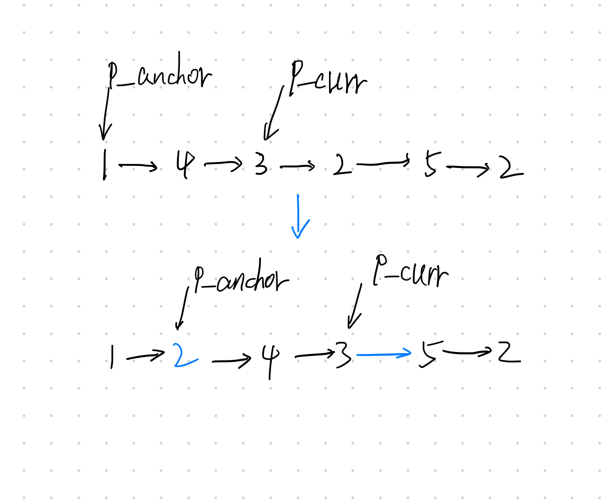

### 题目
给你一个链表的头节点 head 和一个特定值 x ，请你对链表进行分隔，使得所有 小于 x 的节点都出现在 大于或等于 x 的节点之前。

你应当 保留 两个分区中每个节点的初始相对位置。

示例1：
```
输入：head = [1,4,3,2,5,2], x = 3
输出：[1,2,2,4,3,5]
```
示例2：
```
输入：head = [2,1], x = 2
输出：[1,2]
```

提示：

- 链表中节点的数目在范围 [0, 200] 内
- -100 <= Node.val <= 100
- -200 <= x <= 200

### 解题
本题没有很花哨的技巧，就是考察指针的基本操作。

解法思路：
- p_anchor始终指向“大于或等于 x 的节点之前”
- p_curr用于遍历结点，比较p_curr的下一个结点是否小于x，是的话进行将其换到“大于或等于 x 的节点之前”。

一次操作过程如下：


代码如下，[代码文件](solution.py)：
```py
class Solution:
    def partition(self, head: ListNode, x: int) -> ListNode:
        dummy = ListNode(0, head)
        p_anchor = None
        p_curr = dummy
        while p_curr and p_curr.next:
            if p_curr.next.val >= x and not p_anchor:
                p_anchor = p_curr
            elif p_curr.next.val < x and p_anchor:
                a = p_anchor.next
                b = p_curr.next
                p_curr.next = p_curr.next.next
                p_anchor.next = b
                b.next = a
                p_anchor = b
                continue
            p_curr = p_curr.next
        return dummy.next
```