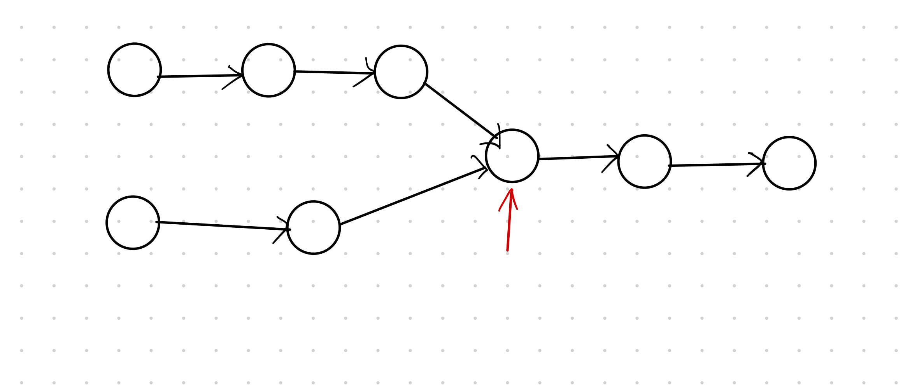

### 题目
输入两个链表，找出它们的第一个公共结点。
如下图中红色箭头指向的就是公共结点：

### 问题分析

碰到链表的题目，首先想一想能不能用双指针和滑动窗口等方案解决，思考下来发现不行。

那么这里有什么规律呢？这里观察链表，发现如果我从最后一个结点往前遍历，最后一个相同的结点就是我要找的第一个公共结点。
而怎么从最后一个结点往前遍历？
**把数据存到栈里，最后一个结点可不就是栈的第一个结点？**

因此这里的思路就出来了。
把两个链表的数据分别存放到两个栈里，最后再把栈里的结点依次弹出，碰到结点不同就结束了。

解题代码实现：[辅助栈解题](stack_solution.py)

### 优化解法
用栈解决了这个问题，但是它的空间复杂度高。能不能不用栈呢？

再来仔细观察这个问题的话，会发现**如果两个链表是一样长的，那么同时遍历遇到第一个相同的结点就是第一个公共结点。**

而现实中两个链表的长度是不一定的，怎么办？
1. 分别遍历两个链表获取两个链表的长度
2. 较长的链表先遍历到长度差值的位置
3. 然后两个链表一起遍历，碰到第一个相同的结点即为第一个公共结点。

代码实现：[position_solution](position_solution.py)
