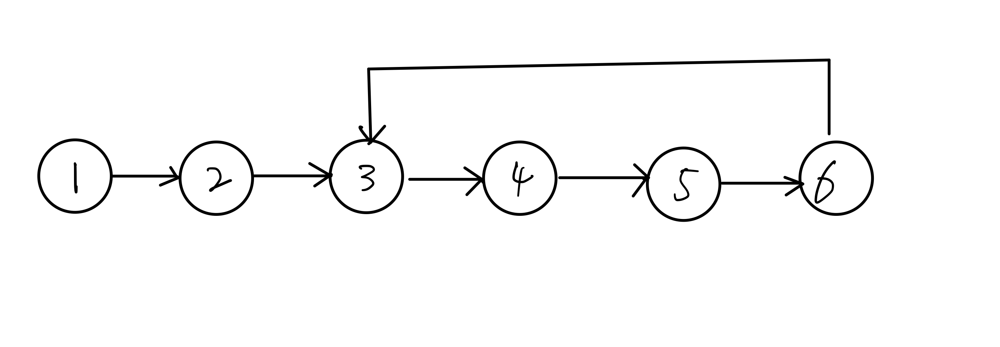

### 题目

一个链表中包含环，如何找出环的入口结点？例如下图的链表中，环的入口结点是结点3。

### 解题思路
判断有环很好做，快慢指针就可以实现。然而如何找到环的入口点呢？
#### 剑指offer解法
剑指offer的解法是先确认环中结点个数，然后再来找入口点。

具体步骤如下：
1. 快慢指针获得相遇结点，这个结点一定在环内（只有环才会相遇）
2. 在相遇点用一个指针迭代获得环的结点数
3. p1从头遍历，遍历次数为结点数。然后p2为头结点与p1一起遍历，当p1和p2相遇时即为入口点。

原理很简单，如下图，当p1走了h时，p2走了h+r，那么下一步两个结点必相遇。

具体看代码实现：[剑指offer解法](solution.py)

#### 另一种解法

这个解法是看到一篇博客：https://segmentfault.com/a/1190000015308120

本质上与剑指offer上的解法是一致的，但是更为简洁。

参照这个思路，具体代码实现：[solution1](solution1.py)

