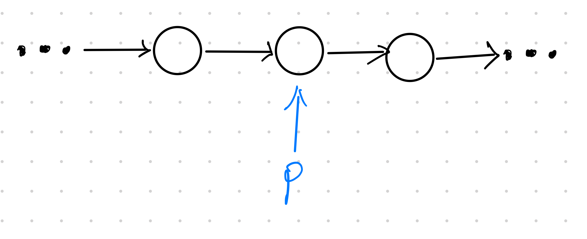

### 题目
假设有一个没有头指针的单链表。一个指针指向此链表中间的一个结点（不是第一个也不是最后一个），请将该结点从单链表中删除。


### 解题思考
一般删除链表结点是这样，找到要删除链表的前一个结点指针pre。然后：
```py
pre.next = pre.next.next
```

然而这道题却只知道要删除的结点，它还是单链表，无法往前遍历获取到前一个结点。所以这道题是无解的？

看完题解的我哑然失笑，原来还能这样玩？？？是我年轻了。

思想是：**狸猫换太子**。


这道题里确实无法直接删除指定结点，因为怎么都无法获取到前一个结点。但是可以删除后一个结点，把后一个结点的数据拷贝到指定结点中，达到类似的目的。